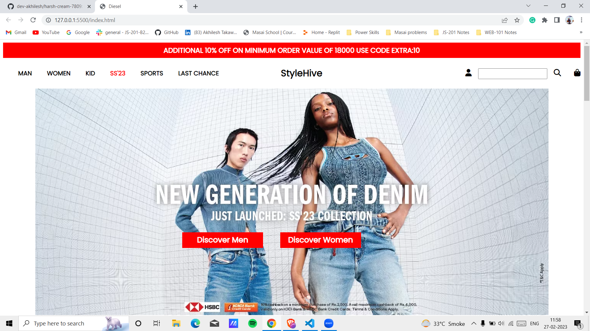
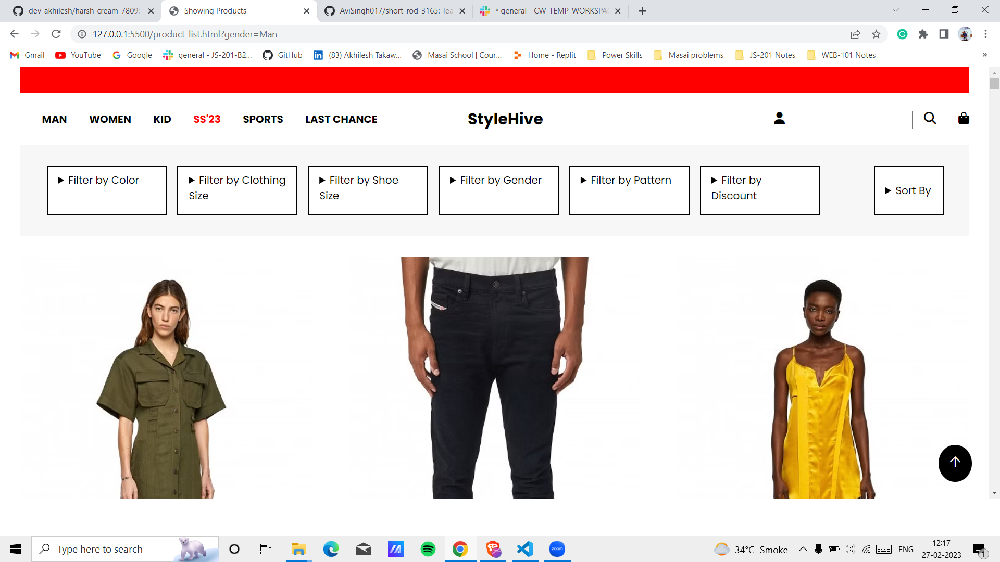
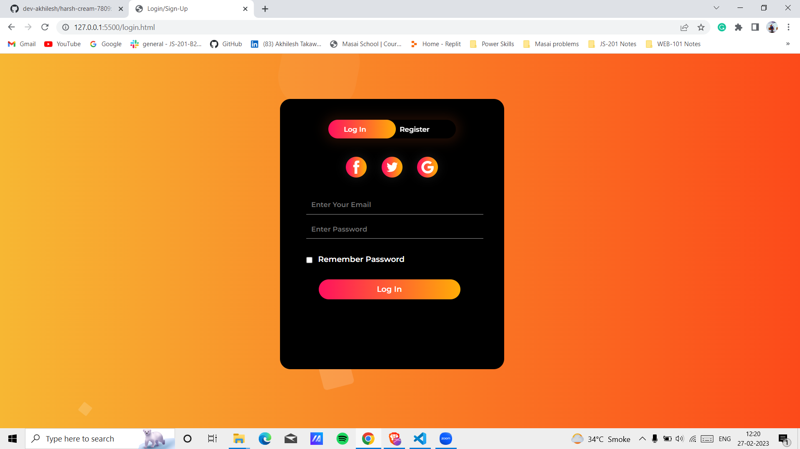
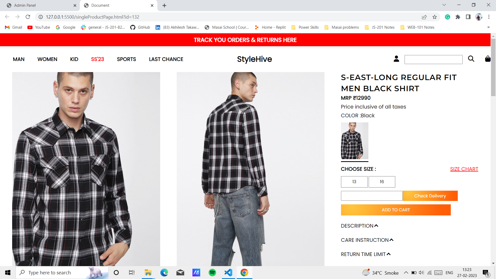
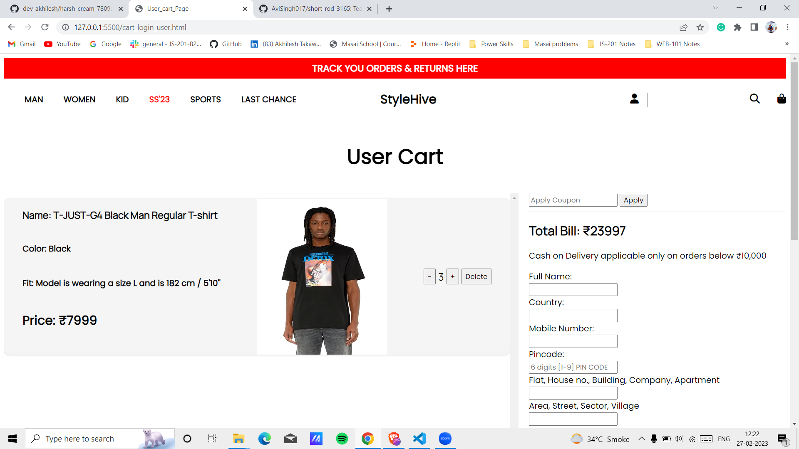
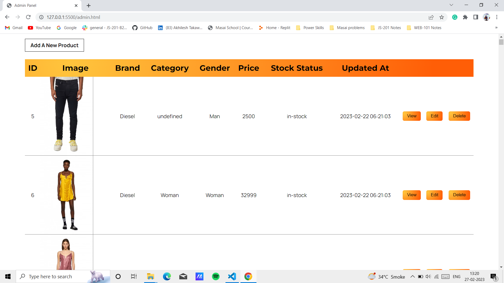

# Diesel

Diesel is a fashion company that was founded in 1978 by Renzo Rosso in Molvena, Italy. The company specializes in denim clothing and accessories, but also offers a range of other fashion products such as watches, footwear, and fragrances.

Diesel.com is the official website of the company, and it offers an online shopping experience for customers all over the world. The website features a wide variety of products for men, women, and children, as well as a range of accessories, including bags, wallets, and sunglasses.

Overall, Diesel.com is a comprehensive and user-friendly website that offers a diverse range of fashion products and content for customers around the world.

## Features

<b>Products Features</b>

| Feature  |  Coded?       | Description  |
|----------|:-------------:|:-------------|
| Add a Product | &#10004; | Ability of Add a Product on the System |
| List Products | &#10004; | Ability of List Products |
| Edit a Product | &#10004; | Ability of Edit a Product |
| Delete a Product | &#10004; | Ability of Delete a Product |
| Stock | &#10004; | Ability of Update the Stock |
| Stock History | &#10004; | Ability to see the Stock History |

<b>Purchase Features</b>

| Feature  |  Coded?       | Description  |
|----------|:-------------:|:-------------|
| Create a Cart | &#10004; | Ability of Create a new Cart |
| See Cart | &#10004; | Ability to see the Cart and it items |
| Remove a Cart | &#10004; | Ability of Remove a Cart |
| Add Item | &#10004; | Ability of add a new Item on the Cart |
| Remove a Item | &#10004; | Ability of Remove a Item from the Cart |
| Checkout | &#10004; | Ability to Checkout |

Navigation: The website has a clear and intuitive navigation menu that allows users to easily find the products they are looking for. The menu includes links to the different product categories, as well as a link to the cart and the account page.

Product Catalog: The product catalog displays all the products available on the website, organized by category. Users can filter the products by price, brand, or other attributes to find the products they are looking for. Each product in the catalog includes an image, a title, a brief description, and the price.

Login Page:

Product Page: The product page provides detailed information about the product, including images, description, features, and reviews. Users can also select the quantity and add the product to their cart from this page.

Shopping Cart: The shopping cart page shows the items that the user has added to the cart, the total price, and the option to proceed to checkout. Users can also update the quantity of items in the cart or remove items from the cart from this page.

Checkout: The checkout page allows users to enter their shipping and billing information, select a shipping method, and make the payment. The website supports multiple payment methods, such as credit card and PayPal.

Admin portal: The website's admin portal allows the website owner to manage the products, inventory, orders, and customers. It also provides analytics and reports on the website's performance and user activity.

Security: The website uses encryption and secure connections to protect the user's personal and payment information. It also implements standard security measures to protect against data breaches and unauthorized access.

Support: The website provides a contact page with an email address and a phone number where users can reach out to the website's support team with any questions or issues. The website also includes a FAQ page and a knowledgebase where users can find answers to common questions.

Overall, this website provides a comprehensive e-commerce platform that is easy to use, well-designed, and secure. It provides all the necessary features for an e-commerce website and it is designed to provide a great user experience for the customers.

## Authors

- [@dev-akhilesh](https://github.com/dev-akhilesh)(Team Lead)
- [@abhirupbakshi](https://github.com/abhirupbakshi)
- [@akhil368](https://github.com/akhil368)
- [@rahul1837](https://github.com/rahul1837)
- [@ganapathi525](https://github.com/Ganapathi525)

